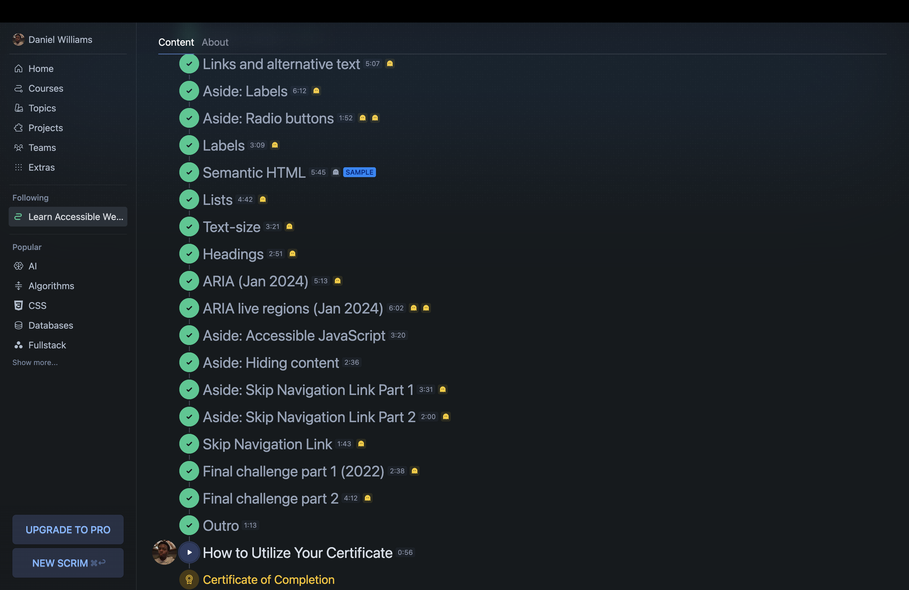

# Getting Started

Install the dependencies and run the project

```
npm install
npm start
```

Head over to https://vitejs.dev/ to learn more about configuring vite

Happy Coding!

Reflection Questions
What accessibility enhancements were the most challenging to implement, and why?
Adding proper Aria roles and labels was the hardest to me because I found it confusing how the screen would to process certain things but not others.
How do ARIA attributes improve the experience for users relying on assistive technologies?
Aria attributes add extra context like, identifying buttons, navigation regions, and live updates.
What tools did you use to check color contrast, and how did they help?
I used chromedevtools and yes they would show the current color contrast.


